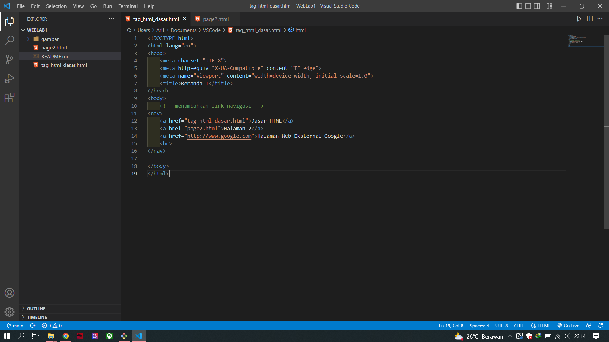
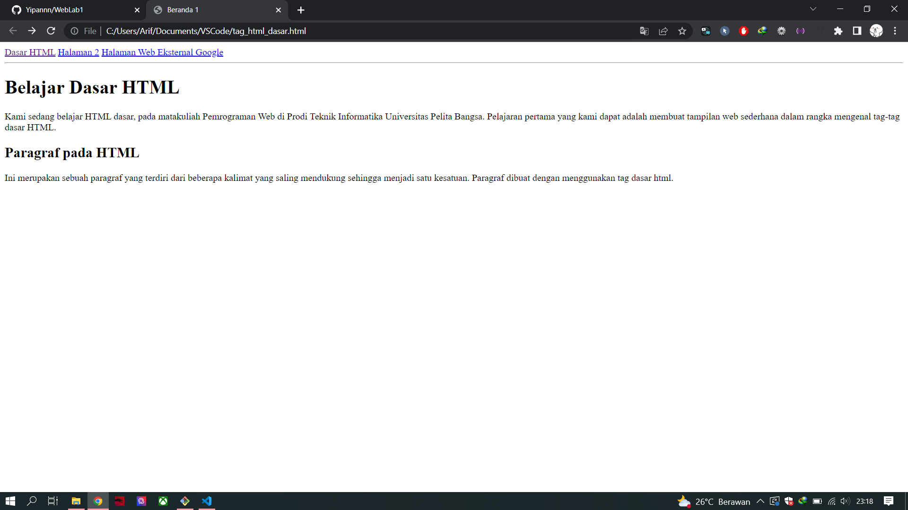
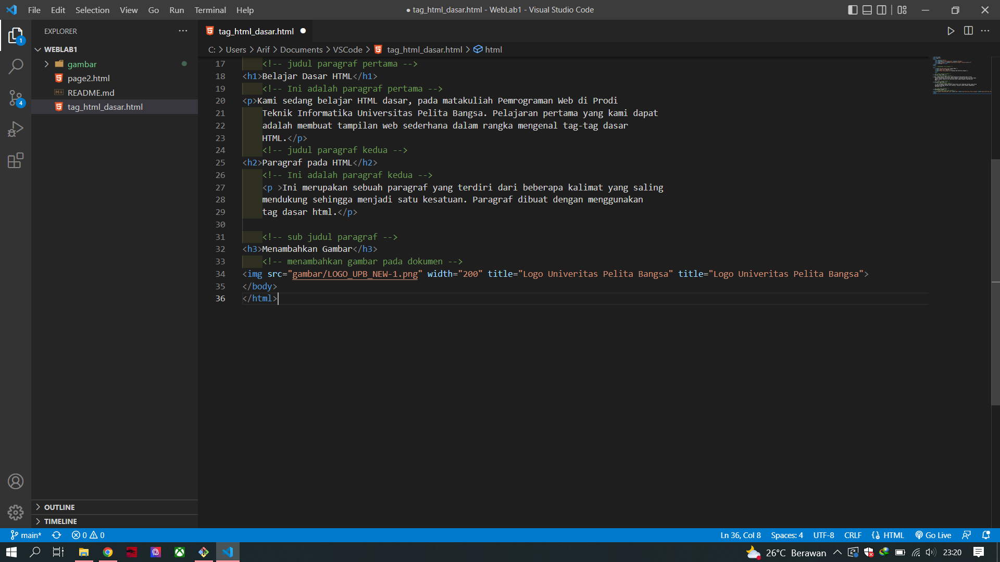
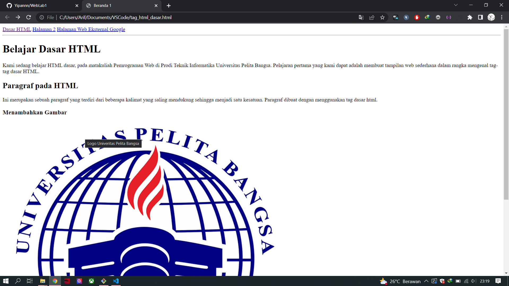
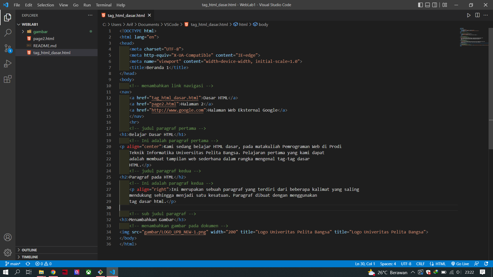
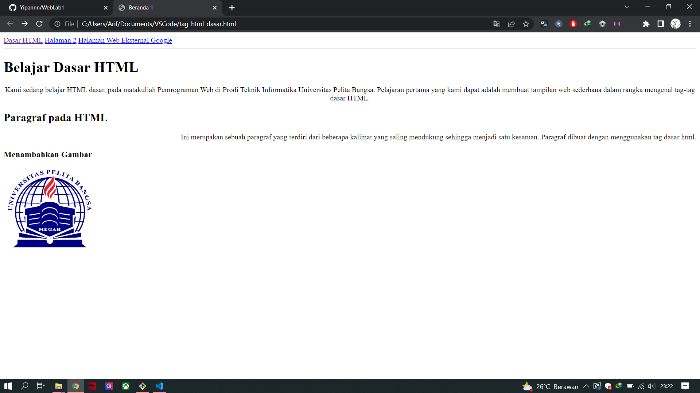

# WebLab1
## Belajar HTML
### Membuat tag navigasi bar pada menu web
dengan cara menggunakan tag `<a href="nama file">judul nav</a>`
ini adalah tampilannya. dan menggunakan tag `
` untuk memberikan garis bawah pada menu navbar

### Tag Paragraf
`
`, dan ` `
Paragraf merupakan kumpulan dari beberapa kalimat. Pada dokumen web, paragraf biasanya
digunakan untuk menampilkan teks atau artikel.
Paragraf pada dokumen HTML dibuat dengan tag 
. Selain itu ada tag pendukung lainnya seperti
` `, `
`, `<pre>`.
` `: break-line (untuk berpindah ke baris selanjutnya)
`
`: Horizontal-line (untuk menambahkan garis horizontal)
`<pre>`: Preformat (untuk menampilkan teks apa adanya tanpa pemformatan)
Contoh paragraf
``
 Isi Ini adalah tulisan yang berada dalam paragraf. Dengan tag ini makatampilan dalam web akan menjadi lebih rapi paragraf 
``

### Membuat paragraf
kode tag untuk paragraf adalah `
`
ini adalah tampilannya

### membuat paragraf ke 2
sama dengan cara pembuatan paragraf pertama dengan menggunakan `
` untuk memulai suatu paragraf
ini adalah tampilannya

### Memasukan gambar
Dengan memasuka gambar pada menu konten denan cara menghubungkan atau memanggi file yang ada di direktori
dengan syarat harus 1 folder dengan kode editor yang digunakan agar mempermudah pencarian konten gambar yang akan di gunakan

ini adalha tampilannya dengan code seperti di bawah

dan ini tampilan yang akan keluar di web

### Mengatur tampilan dengan menyisipkan tag didalam tag
untuk mengatur paragraf dengan cara menggunakan `align="center"` di dalam tag `
`
seperti `
...isi konten...
`
mengatur tampilan gambar yang terlalu besar dengan cara menyisipkan `width=200`
contoh gambar sebagai berikut

